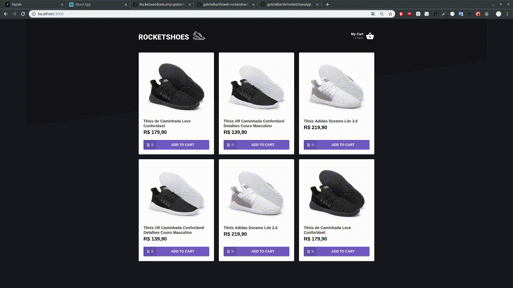
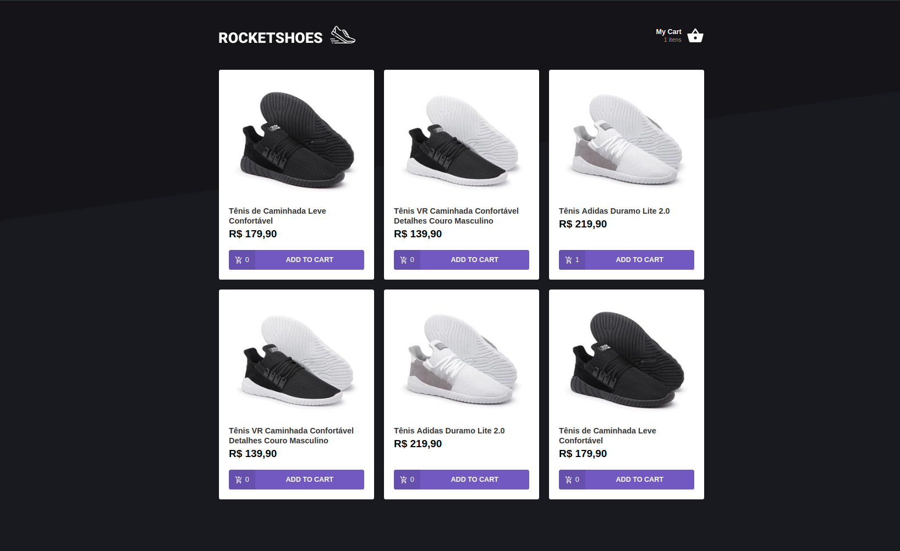
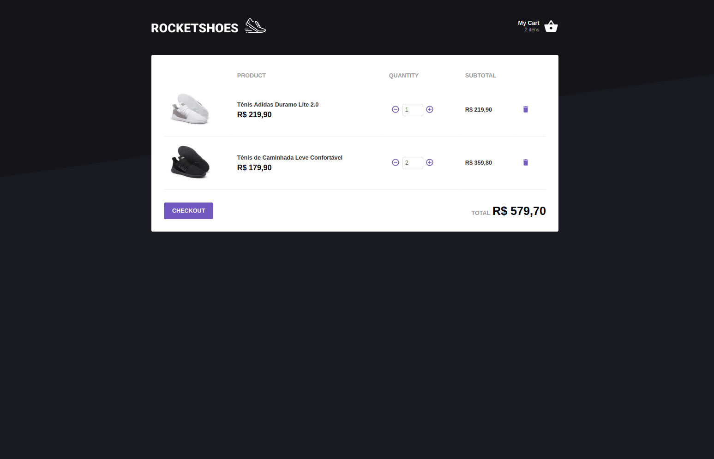

<h1 align="center">
  
</h1>
<h3 align="center">
:computer: Mobile version <a href="https://github.com/gabrielbarth/rocketshoes-mobile">here</a>
</h3>

:us: 
 
Web application to simulate shoes ecommerce in two pages: Home and Cart. Developed during <a href="https://rocketseat.com.br/">GoStack10 bootcamp</a>.
 
&#x1f1e7;&#x1f1f7;
 
Aplicação web para simular um ecommerce de tênis em duas páginas: Home e Carrinho. Desenvolvido durante as aulas do <a href="https://rocketseat.com.br/">bootcamp GoStack10</a>.

##  :mag_right: Main points covered on project / Principais pontos
:us: 
- We styled the application with styled-components, which facilitates and centralizes the styling of the app's components;
- We use JSON-SERVER to simulate data from an API and provide the necessary information;
- We use Redux to manipulate the global states of the application;
- We also use Redux-saga, which allowed us to verify certain information before actually making changes to the store (global state of the application)
- We connected the application with reactotron, which allowed us to follow the flow of information through the application, basically: COMPONENT -> ACTION -> REDUCER (STORE CHANGE) -> REDUX NOTIFY ALL COMPONENTS ABOUT THAT UPDATE AND WHICH IS WAITING FOR THE NOTICE IT IS RENDERED / UPDATED.

**[UPDATE]:** From the commit <a href="https://github.com/gabrielbarth/web-rocketshoes/commit/45210af6de1650f48de1995f60bc43667742a8c9">updatting components to react-hooks</a> 
this app started to use react-hooks.

 

&#x1f1e7;&#x1f1f7;
- Estilizamos a aplicação com styled-componentes, o que facilita e centraliza a estilização dos componentes do app;
- Utilizamos JSON-SERVER para simular dados de uma API e fornecer as informações necessárias;
- Utilizamos o Redux, para manipulação dos estados globais da aplicação;
- Tamém usamos o Redux-saga, que permitiu verificar determinadas informações antes de factualmente realizar mudanças no store (estado global da aplicação);
- Conectamos a aplicação com o reactotron, que nos permitiu acompanhar o fluxo de informações pela aplicação, basicamente: COMPONENTE -> ACTION -> REDUCER (ALTERAÇÃO DA STORE) -> REDUX INFORMA TODOS OS COMPONENTES SOBRE A ATUALIZAÇÃO E, O COMPONENTE QUE ESTIVER AGUARDANDO ESSA ATUALIZAÇÃO É RENDERIZADO/ATUALIZADO.  

**[ATUALIZAÇÃO]:** A partir do commit <a href="https://github.com/gabrielbarth/web-rocketshoes/commit/45210af6de1650f48de1995f60bc43667742a8c9">updatting components to react-hooks</a>, a aplicação passou a utilizar react-hooks. 

 

##  :computer: View of interface / Visão da interface

  
  
  

 

##  :link: Project dependencies / Bibliotecas utilizadas

:ballot_box_with_check: **<a href="https://pt-br.reactjs.org/">react</a>**     `// react lib`  
:ballot_box_with_check: **<a href="https://www.npmjs.com/package/react-icons">react-icons</a>**      `// allows to use icons from several libs`   
:ballot_box_with_check: **<a href="https://github.com/axios/axios">axios</a>**            `// Promise based HTTP client for the browser and node.js`   
:ballot_box_with_check: **<a href="https://styled-components.com/">styled-components</a>**            `// allows to write actual CSS code to style components`   
:ballot_box_with_check: **<a href="https://www.npmjs.com/package/prop-types">prop-types</a>**            `// used to document the intended types of properties passed to components`   
:ballot_box_with_check: **<a href="https://redux.js.org/">redux</a>**            `// allows manage app global state `   
:ballot_box_with_check: **<a href="https://github.com/redux-saga/redux-saga">redux-saga</a>**            `// allows manage app global state using middlewares (each other things) `   
:ballot_box_with_check: **<a href="https://github.com/infinitered/reactotron">reactotron-react-js</a>**            `// desktop app for inspecting informations through the app`   
:ballot_box_with_check: **<a href="https://github.com/infinitered/reactotron/blob/master/docs/plugin-redux.md">reactotron-redux</a>**            `// allow us observing using of middlewares in API requests `   
:ballot_box_with_check: **<a href="https://www.npmjs.com/package/react-dom">react-dom</a>**    `// allows to load react through <script> tag `  
:ballot_box_with_check: **<a href="https://www.npmjs.com/package/react-router-dom">react-router-dom</a>**         `// DOM bindings for React Router `  
:ballot_box_with_check: **<a href="https://github.com/immerjs/immer">immer</a>**     `// allows create the next immutable state by mutating the current one`  
:ballot_box_with_check: **<a href="https://polished.js.org/"> polished </a>**     `// a lightweight toolset for writing styles in JavaScript`  
:ballot_box_with_check: **<a href="https://github.com/ReactTraining/history"> history </a>**     `// allows manage session history with JavaScript`  

**Development libs / Bibliotecas de desenvolvimento utilizadas no projeto:**
 
:ballot_box_with_check: **<a href="https://eslint.org/">eslint</a>**    `// finds and fixes code errors` 
 
:ballot_box_with_check: **<a href="https://prettier.io/">prettier</a>**  `// makes code prettier` 
 
